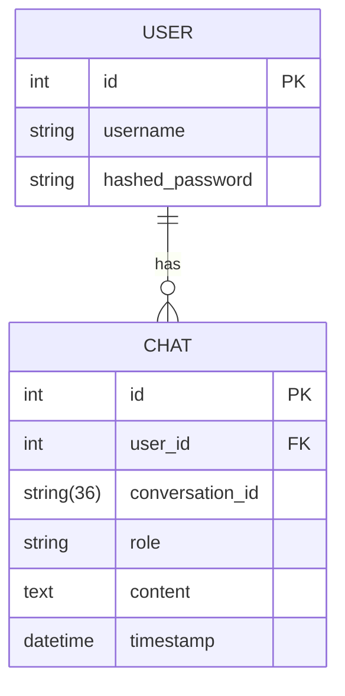

# FastAPI LLM Middleware Server


## Table of Contents
- [Architecture](#architecture)
- [Endpoints](#endpoints)
- [Memory Management](#memory-management)
- [Environment Variables](#environment-variables)
- [Development](#development)
- [Deployment](#deployment)

## Architecture

```plaintext
Client → FastAPI Middleware → LLM Backend
                   ↓
               SQLite DB
                   ↓
             FAISS Vector Store
```

# FastAPI LLM Middleware Server

**A high-performance middleware server for LLM applications featuring JWT authentication, conversation management, and semantic memory**


## 🔍 Overview

This middleware server acts as a bridge between frontend clients and LLM backends, providing:

- Secure user authentication
- Conversation history management
- Context-aware memory system
- API standardization layer

## 🚀 Key Features

- **JWT Authentication**: Secure user management with access tokens
- **Conversation Persistence**: SQLite database storage for all chats
- **Semantic Memory**: FAISS-powered context retrieval
- **Modular Design**: Easy integration with different LLM backends
- **Production-Ready**: Async endpoints with proper error handling

## 🛠️ Tech Stack

- Python 3.10+
- FastAPI
- SQLAlchemy (SQLite)
- FAISS (vector similarity)
- Sentence Transformers (embeddings)
- JWT (authentication)

## 📦 Installation

```bash
# Clone repository
git clone https://github.com/mic-cyberkid/LLM-MIDDLEWARE.git
cd LLM-MIDDLEWARE

# Create virtual environment
python -m venv venv
source venv/bin/activate  # Windows: venv\Scripts\activate

# Install dependencies
pip install -r requirements.txt

# Initialize database
python init_db.py
```

## ⚙️ Configuration

Create `.env` file:

```ini
DATABASE_URL=sqlite:///data/chatbot.db
SECRET_KEY=your-secret-key-here
ACCESS_TOKEN_EXPIRE_MINUTES=1440  # 24 hours
LLM_API_URL=http://localhost:11434/api/generate
EMBEDDING_MODEL=all-MiniLM-L6-v2
```

## 🏃 Running the Server

```bash
uvicorn main:app --reload --host 0.0.0.0 --port 8000
```

Access docs at:
- Swagger UI: `http://localhost:8000/docs`
- ReDoc: `http://localhost:8000/redoc`

## 🧠 Memory System

The server maintains two memory layers:
1. **Recent History**: Last N messages (configurable)
2. **Long-Term Memory**: FAISS index of all messages with:
   - Vector embeddings
   - Semantic search
   - Automatic summarization

## 📊 Database Schema



## 📜 License

MIT License - See [LICENSE](LICENSE)

---

## Architecture

```plaintext
Client → FastAPI Middleware → LLM Backend
                   ↓
               SQLite DB
                   ↓
             FAISS Vector Store
```

## 📚 API Reference

### Authentication
| Endpoint | Method | Description |
|----------|--------|-------------|
| `/llm/register` | POST | Register new user |
| `/llm/token` | POST | Login and get JWT token |

### Endpoints
| Endpoint | Method | Description |
|----------|--------|-------------|
| `/llm/chat` | POST | Send/receive messages |
| `/llm/conversations` | GET | List all conversations |
| `/llm/conversations/{id}` | GET | Get specific conversation |
| `/llm/conversations/{id}` | DELETE | Delete conversation |


### API USAGE
- `POST /llm/register`
  ```json
  {
    "username": "string",
    "password": "string"
  }
  ```

- `POST /llm/token`
  ```json
  {
    "access_token": "string",
    "token_type": "bearer"
  }
  ```

### Chat Operations
- `POST /llm/chat`
  ```json
  {
    "conversation_id": "string",
    "message": "string"
  }
  ```

## Memory Management

The server implements a hybrid memory system:

1. **Recent Messages**: In-memory buffer of last 10 messages
2. **Vector Store**: FAISS index of historical messages
3. **Automatic Summarization**: BART-based summarization of old context

```python
class MemoryManager:
    def __init__(self):
        self.recent_history = []  # Short-term
        self.vector_index = None  # Long-term
```

## Environment Variables

| Variable | Description | Default |
|----------|-------------|---------|
| `DATABASE_URL` | SQLAlchemy connection string | `sqlite:///data/chatbot.db` |
| `SECRET_KEY` | JWT signing key | REQUIRED |
| `LLM_API_URL` | LLM backend endpoint | `http://localhost:11434` |

## Development

1. Install dev dependencies:
```bash
pip install -r requirements.txt
```

2. Run tests:
```bash
pytest tests/
```

3. Code formatting:
```bash
black .
isort .
```

## Deployment

## Windows Executable
```bash
cd LLM-MIDDLEWARE
pip install pyinstaller
pyinstaller --one-file main.py
```
** Locate executable file in dist directory created by pyinstaller **
### Docker
```dockerfile
FROM python:3.10-slim

WORKDIR /app
COPY . .

RUN pip install -r requirements.txt

CMD ["uvicorn", "main:app", "--host", "0.0.0.0", "--port", "8000"]
```

---
